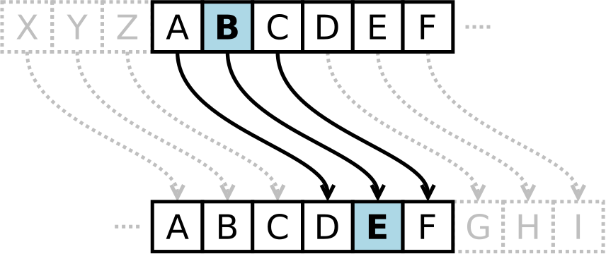

# Code de César

Nous allons voir un algorithme de déchiffrage d'un code de César fondé sur le calcul de fréquence d'apparitions de certaines lettres dans un texte.

## Principe du code de César

On choisit $c$  ($c \in \mathbb{N}, 1 \leq c \leq 25$) qui sert de clé et le principe de chiffrement est de décaler chaque lettre de $c$ emplacements dans l'alphabet.

Par exemple, avec la clé $c=7$, le texte `DIDAPRO` devient : `KPKHWYV`. En effet :
```
ABCDEFGHIJ ...
||||||||||
HIJKLMNOPQ ...
```

??? exercice "Exercice"

    1. Sur l'illustration suivante, quel est la clé utilisée ?

        { width=40% }

        === "Votre réponse"

            - [ ] 2  
            - [ ] 7
            - [ ] 3
            - [ ] 11

        === "Solution"

            - [ ] 2 
            - [ ] 7
            - [x] 3
            - [ ] 11

    2. Exo dépassement

    3. Déchiffrer bidule ..

